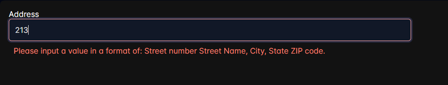

<h1 align="center">Ngx Validator Pack</h1>

<a name="start"></a>

<p align="center">
  
  <br>
  <em>Ngx Validator Pack is a collection of validators designed 
    <br> to simplify usage and allow quick customization.</em>
  <br>
</p>

## Table of Contents

- [Ngx Validator Pack](#ngx-validator-pack) - [_A pack of validators for Angular Form Group and Form Controls_](#a-pack-of-validators-for-angular-form-group-and-form-controls)
  - [Installation](#install)
  - [Forms Validators](#reactive-forms-validators)
    - [RegExp Validators](#regexp-validators)
    - [Date Validators](#date-validators)
    - [Conditional Validators](#conditional-validators)
    - [Prebuilt Validators](#prebuilt-validators)
      - [Address](#address)
      - [Alphabet](#alphabet)
      - [Date](#date)
      - [Email](#email)
      - [IP Address](#ip-address)
      - [Numeric](#numeric)
      - [Special Characters](#special)
      - [Passport](#passport)
      - [Password](#password)
      - [Phone](#phone)
      - [Space](#space)
      - [Social Security Number](#ssn)
      - [Time](#time)
      - [URL](#url)
      - [Zip Code](#zip-code)
  - [Cross Field Validators](#cross-field-validators)
  - [Custom Messaging](#custom-messaging)
    - [Custom Messages for Forms Validators](#ngx-custom-messages)
    - [Custom Messages for Prebuilt Validators](#ngx-custom-prebuilt-messages)
    - [Custom Messages for Cross Field Validator](#ngx-custom-fb-messages)
  - [Showing validation](#showing-validation)
    - [Styling](#styling)
    - [PrimeNG Implementation](#primeng)

## Installation

```bash
npm install --save @dynamize/ngx-validator-pack
```

## Reactive Forms Validators

<a name="reactive-forms-validators"></a>

### RegExp Validators

<a name="regexp-validators"></a>

<mark>regexpValidator</mark> returns an error if the value does not match the regular expression

regexpValidator Example:

```javascript
import { regexpValidator } from '@dynamize/ngx-validator-pack';

@Component({
  selector: 'app-root',
  standalone: true,
  imports: [ReactiveFormsModule],
  templateUrl: './app.component.html',
  styleUrl: './app.component.scss'
})
export class AppComponent implements OnInit{
  exampleForm!: FormGroup;
  constructor(private readonly fb: FormBuilder) { }

  ngOnInit(): void {
    this.exampleForm = this.fb.group({
      regexpInput: [null, [regexpValidator(/(s|regexp)/, '!!')]]
    })
  }
}
```

In this example we are checking if the input is a word regexp, if not we will get an error.

regexpValidator Example ?:

```javascript
import { regexpValidator } from '@dynamize/ngx-validator-pack';

@Component({
  selector: 'app-root',
  standalone: true,
  imports: [ReactiveFormsModule],
  templateUrl: './app.component.html',
  styleUrl: './app.component.scss'
})
export class AppComponent implements OnInit{
  exampleForm!: FormGroup;
  constructor(private readonly fb: FormBuilder) { }

  ngOnInit(): void {
    this.exampleForm = this.fb.group({
      regexpNotInput: [null, [regexpValidator(/(s|regexp)/, '!')]]
    })
  }
}
```

In this example we are checking if the input is not a word regexp, if not we will get an error.

Additionally we can supply two other optional parameters, first being the name of the error and
the second a string which will represent the error content / message.

### Date Validators

<a name="date-validators"></a>

We have three types of validators to compare date values (date picker values).

<mark>earlierThenValidator</mark> checks if a picked date is earlier then a give one.

<mark>laterThenValidator</mark> checks if a picked date is later then a give one.

<mark>compareToValidator</mark> compares the value of a given input to the value of the form control
whose name was given as a first parameter. The second parameter is a string representing
the comparison.

earlierThenValidator Example:

```javascript
import { earlierThenValidator } from '@dynamize/ngx-validator-pack';

@Component({
  selector: 'app-root',
  standalone: true,
  imports: [ReactiveFormsModule],
  templateUrl: './app.component.html',
  styleUrl: './app.component.scss'
})
export class AppComponent implements OnInit{
  exampleForm!: FormGroup;
  constructor(private readonly fb: FormBuilder) { }

  ngOnInit(): void {
    this.exampleForm = this.fb.group({
      earlierDate: [null, [earlierThenValidator(new Date())]]
    })
  }
}
```

laterThenValidator Example:

```javascript
import { laterThenValidator } from '@dynamize/ngx-validator-pack';

@Component({
  selector: 'app-root',
  standalone: true,
  imports: [ReactiveFormsModule],
  templateUrl: './app.component.html',
  styleUrl: './app.component.scss'
})
export class AppComponent implements OnInit{
  exampleForm!: FormGroup;
  constructor(private readonly fb: FormBuilder) { }

  ngOnInit(): void {
    this.exampleForm = this.fb.group({
      laterDate: [null, [laterThenValidator(new Date())]]
    })
  }
}
```

compareToValidator Example:

```javascript
import { compareToValidator } from '@dynamize/ngx-validator-pack';

@Component({
  selector: 'app-root',
  standalone: true,
  imports: [ReactiveFormsModule],
  templateUrl: './app.component.html',
  styleUrl: './app.component.scss'
})
export class AppComponent implements OnInit{
  exampleForm!: FormGroup;
  constructor(private readonly fb: FormBuilder) { }

  ngOnInit(): void {
    this.exampleForm = this.fb.group({
      controlDate: [null],
      compareDate: [null, [compareToValidator("controlDate", ">=")]]
    })
  }
}
```

The available comparisons are: '<', '>', '==', '===', '<=', '>='.

Additionally we can supply two other optional parameters, first being the name of the error and
the second a string which will represent the error content / message.
Please check the example here: [additional parameters example](#additional-params).

### Conditional Validators

<a name="conditional-validators"></a>

We have three conditional validators we can use:

<mark>requiredWhenValidator</mark> excepts a conditional function or a boolean value,
and will return an error if a conditional is satisfied.

<mark>linkToValidator</mark> links to another form control in the form group and will
return an error if a given form control does not have a value but a linked one does.

<mark>linkedToValidator</mark> returns an error if a form control it is linked to does
not have a value but a given control does.

requiredWhenValidator Example:

```javascript
import { requiredWhenValidator } from '@dynamize/ngx-validator-pack';

@Component({
  selector: 'app-root',
  standalone: true,
  imports: [ReactiveFormsModule],
  templateUrl: './app.component.html',
  styleUrl: './app.component.scss'
})
export class AppComponent implements OnInit{
  exampleForm!: FormGroup;
  randomBool = (): boolean => Math.random() >= 0.5;

  constructor(private readonly fb: FormBuilder) { }

  ngOnInit(): void {
    this.exampleForm = this.fb.group({
      requiredWhen: [null, [requiredWhenValidator(this.randomBool())]]
    })
  }
}
```

linkToValidator and linkedToValidator Example:

```javascript
import { linkToValidator, linkedToValidator } from '@dynamize/ngx-validator-pack';

@Component({
  selector: 'app-root',
  standalone: true,
  imports: [ReactiveFormsModule],
  templateUrl: './app.component.html',
  styleUrl: './app.component.scss'
})
export class AppComponent implements OnInit{
  exampleForm!: FormGroup;
  randomBool = (): boolean => Math.random() >= 0.5;

  constructor(private readonly fb: FormBuilder) { }

  ngOnInit(): void {
    this.exampleForm = this.fb.group({
      linkTo: [null, [linkToValidator("linkedTo")]],
      linkedTo: [null, [linkedToValidator("linkTo")]],
    })
  }
}
```

Additionally we can supply two other optional parameters, first being the name of the error and
the second a string which will represent the error content / message.
Please check the example here: [additional parameters example](#additional-params).

## Prebuilt Validators

<a name="prebuilt-validators"></a>

There is a number of prebuilt validators for most common text input validations.

### Address

<a name="address"></a>

We can use <marl>addressValidator</marl> to validate the most common USA address format
(example: 3344 W Alameda Avenue, Lakewood, CO 80222).

```javascript
import { addressValidator } from '@dynamize/ngx-validator-pack';

@Component({
  selector: 'app-root',
  standalone: true,
  imports: [ReactiveFormsModule],
  templateUrl: './app.component.html',
  styleUrl: './app.component.scss'
})
export class AppComponent implements OnInit{
  exampleForm!: FormGroup;
  randomBool = (): boolean => Math.random() >= 0.5;

  constructor(private readonly fb: FormBuilder) { }

  ngOnInit(): void {
    this.exampleForm = this.fb.group({
      address: [null, [addressValidator()]]
    })
  }
}
```

### Alphabet

<a name="alphabet"></a>

<mark>alphabetOnlyValidator</mark> will return an error if any charter other then alphabetical are
in the given input.

```javascript
import { alphabetOnlyValidator } from '@dynamize/ngx-validator-pack';

@Component({
  selector: 'app-root',
  standalone: true,
  imports: [ReactiveFormsModule],
  templateUrl: './app.component.html',
  styleUrl: './app.component.scss'
})
export class AppComponent implements OnInit{
  exampleForm!: FormGroup;
  randomBool = (): boolean => Math.random() >= 0.5;

  constructor(private readonly fb: FormBuilder) { }

  ngOnInit(): void {
    this.exampleForm = this.fb.group({
      alphabet: [null, [alphabetOnlyValidator()]]
    })
  }
}
```

It has two optional parameters first being the name of the error and
the second a string which will represent the error content / message.
Please check the example here: [additional parameters example](#additional-params-prebuilt).

### Date

<a name="date"></a>

We have two validators to validate text inputs for a date format:

<mark>dateDD_MM_YYYYValidator</mark> checks for following formats: dd-MM-YYYY, dd.MM.YYYY or
dd/MM/YYYY.

<mark>dateYYYY_MM_DDValidator</mark>checks for following format YYYY-MM-dd.

```javascript
import { dateDD_MM_YYYYValidator, dateYYYY_MM_DDValidator} from '@dynamize/ngx-validator-pack';

@Component({
  selector: 'app-root',
  standalone: true,
  imports: [ReactiveFormsModule],
  templateUrl: './app.component.html',
  styleUrl: './app.component.scss'
})
export class AppComponent implements OnInit{
  exampleForm!: FormGroup;
  randomBool = (): boolean => Math.random() >= 0.5;

  constructor(private readonly fb: FormBuilder) { }

  ngOnInit(): void {
    this.exampleForm = this.fb.group({
      dateDDMMYYYY: [null, [dateDD_MM_YYYYValidator()]],
      dateYYYYMMDD: [null, [dateYYYY_MM_DDValidator()]]
    })
  }
}
```

It has two optional parameters first being the name of the error and
the second a string which will represent the error content / message.
Please check the example here: [additional parameters example](#additional-params-prebuilt).

### Email

<a name="email"></a>

We can use <mark>emailValidator</mark> to validate a text input for an email format.
(example: local-part@domain.com)

```javascript
import { emailValidator } from '@dynamize/ngx-validator-pack';

@Component({
  selector: 'app-root',
  standalone: true,
  imports: [ReactiveFormsModule],
  templateUrl: './app.component.html',
  styleUrl: './app.component.scss'
})
export class AppComponent implements OnInit{
  exampleForm!: FormGroup;
  randomBool = (): boolean => Math.random() >= 0.5;

  constructor(private readonly fb: FormBuilder) { }

  ngOnInit(): void {
    this.exampleForm = this.fb.group({
      email: [null, [emailValidator()]]
    })
  }
}
```

It has two optional parameters first being the name of the error and
the second a string which will represent the error content / message.
Please check the example here: [additional parameters example](#additional-params-prebuilt).

### IP Address

<a name="ip-address"></a>

We can preform ip address validation on a text input with the following validators:

<mark>ipAddressValidator</mark> preforms a check for both IPv4 and IPv6 formats.
(format examples: x.x.x.x or y:y:y:y:y:y:y:y)

<mark>iPv4Validator</mark> preforms a check for a IPv4 format. (x.x.x.x)

<mark>iPv6Validator</mark> preforms a check for a IPv6 format. (y:y:y:y:y:y:y:y)

```javascript
import {
  ipAddressValidator,
  iPv4Validator,
  iPv6Validator
  } from '@dynamize/ngx-validator-pack';

@Component({
  selector: 'app-root',
  standalone: true,
  imports: [ReactiveFormsModule],
  templateUrl: './app.component.html',
  styleUrl: './app.component.scss'
})
export class AppComponent implements OnInit{
  exampleForm!: FormGroup;
  randomBool = (): boolean => Math.random() >= 0.5;

  constructor(private readonly fb: FormBuilder) { }

  ngOnInit(): void {
    this.exampleForm = this.fb.group({
      ipAddress: [null, [ipAddressValidator()]],
      ipv4: [null, [iPv4Validator()]],
      ipv6: [null, [iPv6Validator()]]
    })
  }
}
```

### Numeric

<a name="numeric"></a>

<mark>numericsOnlyValidator</mark> will return an error if any charter other then numerical are
in the given input.

```javascript
import { numericsOnlyValidator } from '@dynamize/ngx-validator-pack';

@Component({
  selector: 'app-root',
  standalone: true,
  imports: [ReactiveFormsModule],
  templateUrl: './app.component.html',
  styleUrl: './app.component.scss'
})
export class AppComponent implements OnInit{
  exampleForm!: FormGroup;
  randomBool = (): boolean => Math.random() >= 0.5;

  constructor(private readonly fb: FormBuilder) { }

  ngOnInit(): void {
    this.exampleForm = this.fb.group({
      numeric: [null, [numericsOnlyValidator()]]
    })
  }
}
```

It has two optional parameters first being the name of the error and
the second a string which will represent the error content / message.
Please check the example here: [additional parameters example](#additional-params-prebuilt).

### Special Characters

<a name="special"></a>

<mark>noSpecialsValidator</mark> will return an error if any spacial charter are in the given input.

```javascript
import { noSpecialsValidator } from '@dynamize/ngx-validator-pack';

@Component({
  selector: 'app-root',
  standalone: true,
  imports: [ReactiveFormsModule],
  templateUrl: './app.component.html',
  styleUrl: './app.component.scss'
})
export class AppComponent implements OnInit{
  exampleForm!: FormGroup;
  randomBool = (): boolean => Math.random() >= 0.5;

  constructor(private readonly fb: FormBuilder) { }

  ngOnInit(): void {
    this.exampleForm = this.fb.group({
      noSpecial: [null, [noSpecialsValidator()]]
    })
  }
}
```

It has two optional parameters first being the name of the error and
the second a string which will represent the error content / message.
Please check the example here: [additional parameters example](#additional-params-prebuilt).

### Passport

<a name="passport"></a>

<mark>passportValidator</mark> checks if the value is in a proper passport format.
(you can check a list of passport format examples here: <a href="https://www.microfocus.com/documentation/idol/IDOL_24_3/EductionGrammars_24.3_Documentation/PII/Content/PII/PII_Examples_Passport.htm">list of passport examples</a>)

```javascript
import { passportValidator } from '@dynamize/ngx-validator-pack';

@Component({
  selector: 'app-root',
  standalone: true,
  imports: [ReactiveFormsModule],
  templateUrl: './app.component.html',
  styleUrl: './app.component.scss'
})
export class AppComponent implements OnInit{
  exampleForm!: FormGroup;
  randomBool = (): boolean => Math.random() >= 0.5;

  constructor(private readonly fb: FormBuilder) { }

  ngOnInit(): void {
    this.exampleForm = this.fb.group({
      passport: [null, [passportValidator()]]
    })
  }
}
```

It has two optional parameters first being the name of the error and
the second a string which will represent the error content / message.
Please check the example here: [additional parameters example](#additional-params-prebuilt).

### Password

<a name="password"></a>

<mark>passwordValidator</mark> checks for password strength on a given input.
(Has at least 1 lowercase letter, 1 uppercase letter, 1 number, 1 special character and has
length of at least 8 characters).

```javascript
import { passwordValidator } from '@dynamize/ngx-validator-pack';

@Component({
  selector: 'app-root',
  standalone: true,
  imports: [ReactiveFormsModule],
  templateUrl: './app.component.html',
  styleUrl: './app.component.scss'
})
export class AppComponent implements OnInit{
  exampleForm!: FormGroup;
  randomBool = (): boolean => Math.random() >= 0.5;

  constructor(private readonly fb: FormBuilder) { }

  ngOnInit(): void {
    this.exampleForm = this.fb.group({
      password: [null, [passwordValidator()]]
    })
  }
}
```

It has two optional parameters first being the name of the error and
the second a string which will represent the error content / message.
Please check the example here: [additional parameters example](#additional-params-prebuilt).

### Phone

<a name="phone"></a>

<mark>phoneNumberValidator</mark> checks for following formats: (000) 000 0000, (000)-000-0000,
(000) 000-0000, (000)000 0000, (000)000-0000.

```javascript
import { phoneNumberValidator } from '@dynamize/ngx-validator-pack';

@Component({
  selector: 'app-root',
  standalone: true,
  imports: [ReactiveFormsModule],
  templateUrl: './app.component.html',
  styleUrl: './app.component.scss'
})
export class AppComponent implements OnInit{
  exampleForm!: FormGroup;
  randomBool = (): boolean => Math.random() >= 0.5;

  constructor(private readonly fb: FormBuilder) { }

  ngOnInit(): void {
    this.exampleForm = this.fb.group({
      phone: [null, [phoneNumberValidator()]]
    })
  }
}
```

It has two optional parameters first being the name of the error and
the second a string which will represent the error content / message.
Please check the example here: [additional parameters example](#additional-params-prebuilt).

### Space

<a name="space"></a>

<mark>spaceValidator</mark> will return an error if an input has a space charter.

<mark>spaceRestrictionValidator</mark> will return an error if a given input starts or ends with a space charter.

```javascript
import { spaceValidator, spaceRestrictionValidator } from '@dynamize/ngx-validator-pack';

@Component({
  selector: 'app-root',
  standalone: true,
  imports: [ReactiveFormsModule],
  templateUrl: './app.component.html',
  styleUrl: './app.component.scss'
})
export class AppComponent implements OnInit{
  exampleForm!: FormGroup;
  randomBool = (): boolean => Math.random() >= 0.5;

  constructor(private readonly fb: FormBuilder) { }

  ngOnInit(): void {
    this.exampleForm = this.fb.group({
      space: [null, [spaceValidator()]],
      spaceRes: [null, [spaceRestrictionValidator()]]
    })
  }
}
```

It has two optional parameters first being the name of the error and
the second a string which will represent the error content / message.
Please check the example here: [additional parameters example](#additional-params-prebuilt).

### Social Security Number

<a name="ssn"></a>

<mark>ssnValidator</mark> will check for the following ssn formats: AAA-GGG-SSSS or AAAGGGSSSS.

```javascript
import { ssnValidator } from '@dynamize/ngx-validator-pack';

@Component({
  selector: 'app-root',
  standalone: true,
  imports: [ReactiveFormsModule],
  templateUrl: './app.component.html',
  styleUrl: './app.component.scss'
})
export class AppComponent implements OnInit{
  exampleForm!: FormGroup;
  randomBool = (): boolean => Math.random() >= 0.5;

  constructor(private readonly fb: FormBuilder) { }

  ngOnInit(): void {
    this.exampleForm = this.fb.group({
      ssn: [null, [ssnValidator()]]
    })
  }
}
```

It has two optional parameters first being the name of the error and
the second a string which will represent the error content / message.
Please check the example here: [additional parameters example](#additional-params-prebuilt).

### Time

<a name="time"></a>

we can use the following three validators to validate text inputs for time formats:

<mark>timeHH_MM_12Validator</mark> validates if the value is in HH:MM 12-hour format with
optional leading 0.

<mark>timeHH_MM_24Validator</mark> validates if the value is in HH:MM 24-hour format with
optional leading 0.

<mark>timeHH_MM_SS_24Validator</mark> validates if the value is in HH:MM:SS 24-hour format.

```javascript
import {
  timeHH_MM_12Validator,
  timeHH_MM_24Validator,
  timeHH_MM_SS_24Validator
 } from '@dynamize/ngx-validator-pack';

@Component({
  selector: 'app-root',
  standalone: true,
  imports: [ReactiveFormsModule],
  templateUrl: './app.component.html',
  styleUrl: './app.component.scss'
})
export class AppComponent implements OnInit{
  exampleForm!: FormGroup;
  randomBool = (): boolean => Math.random() >= 0.5;

  constructor(private readonly fb: FormBuilder) { }

  ngOnInit(): void {
    this.exampleForm = this.fb.group({
      timeHHMM12: [null, [timeHH_MM_12Validator()]],
      timeHHMM24: [null, [timeHH_MM_24Validator()]],
      timeHHMMSS24: [null, [timeHH_MM_SS_24Validator()]]
    })
  }
}
```

It has two optional parameters first being the name of the error and
the second a string which will represent the error content / message.
Please check the example here: [additional parameters example](#additional-params-prebuilt).

### URL

<a name="url"></a>

<mark>urlValidator</mark> checks the given input for a url format.

```javascript
import { urlValidator } from '@dynamize/ngx-validator-pack';

@Component({
  selector: 'app-root',
  standalone: true,
  imports: [ReactiveFormsModule],
  templateUrl: './app.component.html',
  styleUrl: './app.component.scss'
})
export class AppComponent implements OnInit{
  exampleForm!: FormGroup;
  randomBool = (): boolean => Math.random() >= 0.5;

  constructor(private readonly fb: FormBuilder) { }

  ngOnInit(): void {
    this.exampleForm = this.fb.group({
      url: [null, [urlValidator()]]
    })
  }
}
```

It has two optional parameters first being the name of the error and
the second a string which will represent the error content / message.
Please check the example here: [additional parameters example](#additional-params-prebuilt).

### Zip Code

<a name="zip-code"></a>

<mark>zipCodeValidator</mark> checks for a valid zip code format.
(format examples: 00000 or 00000-0000)

```javascript
import { zipCodeValidator } from '@dynamize/ngx-validator-pack';

@Component({
  selector: 'app-root',
  standalone: true,
  imports: [ReactiveFormsModule],
  templateUrl: './app.component.html',
  styleUrl: './app.component.scss'
})
export class AppComponent implements OnInit{
  exampleForm!: FormGroup;
  randomBool = (): boolean => Math.random() >= 0.5;

  constructor(private readonly fb: FormBuilder) { }

  ngOnInit(): void {
    this.exampleForm = this.fb.group({
      zipCode: [null, [zipCodeValidator()]]
    })
  }
}
```

## Cross Field Validators

<a name="cross-field-validators"></a>

The following validators preform validation on a Form Group rather the Form Control.
They all take two parameters, first one being the name of the control which should be required
if the condition is met and the second parameter is the name of the control which is being checked.

<mark>requiredIf</mark> assigns a required status to a given control if the control which is being checked has a value and the given control does not.

<mark>requiredIfNot</mark> assigns a required status to a given control if the control which is being checked does not have a value and the given control does.

<mark>requiredEther</mark> assigns a required status to a given control if the control which is being checked and a given control do not have values.

```javascript
import { requiredEther, requiredIf, requiredIfNot } from '@dynamize/ngx-validator-pack';

@Component({
  selector: 'app-root',
  standalone: true,
  imports: [ReactiveFormsModule],
  templateUrl: './app.component.html',
  styleUrl: './app.component.scss'
})
export class AppComponent implements OnInit{
  exampleForm!: FormGroup;
  randomBool = (): boolean => Math.random() >= 0.5;

  constructor(private readonly fb: FormBuilder) { }

  ngOnInit(): void {
    this.exampleForm = this.fb.group({
      compare: [null],
      if: [null],
      ifNot: [null],
      ether: [null]
    }, {
      validators: [
        requiredIf('if', 'compare'),
        requiredIfNot('ifNot', 'compare'),
        requiredEther('ether', 'compare')
      ]
    })
  }
}
```

## Custom Messaging

One of the main reason for creating this library if not the main reason is the ability to
have a custom error message for each individual implementation of the validators. Let's
explore this further in this section.

### Custom Messages for Reactive Forms Validators

<a name="additional-params"></a>
<a name="ngx-custom-messages"></a>

All reactive forms validators take addition optional parameters.

<mark>First</mark> one being the name of the error we would like to use.

<mark>Second</mark> one is the error messages we would like to use.

In this example we are using regexpValidator and regexpNotValidator, but implementation is
identical for all other ngx validators.

```javascript
import { regexpValidator, regexpNotValidator } from '@dynamize/ngx-validator-pack';

@Component({
  selector: 'app-root',
  standalone: true,
  imports: [ReactiveFormsModule],
  templateUrl: './app.component.html',
  styleUrl: './app.component.scss'
})
export class AppComponent implements OnInit {
  exampleForm!: FormGroup;
  constructor(private readonly fb: FormBuilder) {}

  ngOnInit(): void {
    this.exampleForm = this.fb.group({
      regexpInput: [
        null,
        [
          regexpValidator(
            /(s|regexp)/,
            'example_regexp_error',        // Error name
            'RegExp validation works!'     // Error Message
          ),
        ],
      ],
      regexpNotInput: [
        null,
        [
          regexpNotValidator(
            /(s|regexp)/,
            'example_regexp_not_error',     // Error name
            'RegExp Not validation works!'  // Error Message
          ),
        ],
      ],
    });
  }
}
```

### Custom Messages for Prebuilt Validators

<a name="additional-params-prebuilt"></a>
<a name="ngx-custom-prebuilt-messages"></a>

Custom error messages are also available for prebuilt validators. The implementation
is slightly different as they don't have any required parameters, they in fact only two
optional ones.

<mark>First</mark> one being the name of the error we would like to use.

<mark>Second</mark> one is the error messages we would like to use.

In this example we are using the addressValidator, but implementation is
identical for all other ngx validators.

```javascript
import { addressValidator } from '@dynamize/ngx-validator-pack';

@Component({
  selector: 'app-root',
  standalone: true,
  imports: [ReactiveFormsModule],
  templateUrl: './app.component.html',
  styleUrl: './app.component.scss'
})
export class AppComponent implements OnInit{
  exampleForm!: FormGroup;
  randomBool = (): boolean => Math.random() >= 0.5;

  constructor(private readonly fb: FormBuilder) { }

  ngOnInit(): void {
    this.exampleForm = this.fb.group({
      address: [null, [addressValidator(
        'address_error_example',  // Error name
        'Wrong address input!'    // Error Message
      )]]
    })
  }
}
```

### Custom Messages for Cross Field Validator

<a name="ngx-custom-fb-messages"></a>

Cross Field Validator also have an option for custom messaging. But the implementation is
slightly different again.

The only take one optional parameter which is a custom error message.

```javascript
import { requiredEther, requiredIf, requiredIfNot } from '@dynamize/ngx-validator-pack';

@Component({
  selector: 'app-root',
  standalone: true,
  imports: [ReactiveFormsModule],
  templateUrl: './app.component.html',
  styleUrl: './app.component.scss'
})
export class AppComponent implements OnInit{
  exampleForm!: FormGroup;
  randomBool = (): boolean => Math.random() >= 0.5;

  constructor(private readonly fb: FormBuilder) { }

  ngOnInit(): void {
    this.exampleForm = this.fb.group({
      compare: [null],
      if: [null],
      ifNot: [null],
      ether: [null]
    }, {
        validators: [
          requiredIf("if", "compare", "Compere input has a value"),
          requiredIfNot(
            "ifNot",
            "compare",
            `Compere input doesn't have a value`
          ),
          requiredEther(
            "ether",
            "compare",
            "Nether the compere input nor this one have a value."
          ),
        ],
    })
  }
}
```

## Showing validation

<a name="showing-validation"></a>

If you would like to show the validation error message to the user, a really convenient way is
using a <mark>showValidation</mark> Directive.
Placing it on an input will automatically show the error message under the input it self.

showValidation Example:

```HTML
<form [formGroup]="exampleForm" id="examples-content">
  <input
    type="text"
    name="address"
    id="address"
    formControlName="address"
    showValidation
    />
</form>
```

The result of the code above is:


### Styling

<a name="styling"></a>

You can pass an <mark>errorStyle</mark> object to customize the look of the validation error:

```HTML
<form [formGroup]="exampleForm" id="examples-content">
  <input
    type="text"
    name="address"
    id="address"
    formControlName="address"
    showValidation
    [errorStyle]="{
      font_size: 'medium',
      color: '#ad03fc',
    }"
  />
</form>
```

The result of the code above is:


The available style options are:

| Name             | CSS representation |
| ---------------- | ------------------ |
| font_size        | font-size          |
| font_family      | font-family        |
| color            | color              |
| background_color | background-color   |
| border           | border             |
| border_radius    | border-radius      |
| width            | width              |
| height           | height             |

### PrimeNG Implementation

<a name="primeng"></a>

<mark>showValidation</mark> Directive is <mark>PrimeNg</mark> compatible:

```HTML
<form [formGroup]="exampleForm" id="examples-content">
  <div class="flex flex-column gap-2">
    <label for="address">Address</label>
    <input
      type="text"
      name="address"
      id="address"
      formControlName="address"
      pInputText
      showValidation
      [errorStyle]="{
        width: '45vw',
        color: 'salmon'
      }"
    />
  </div>
</form>
```

The result of the code above is:


